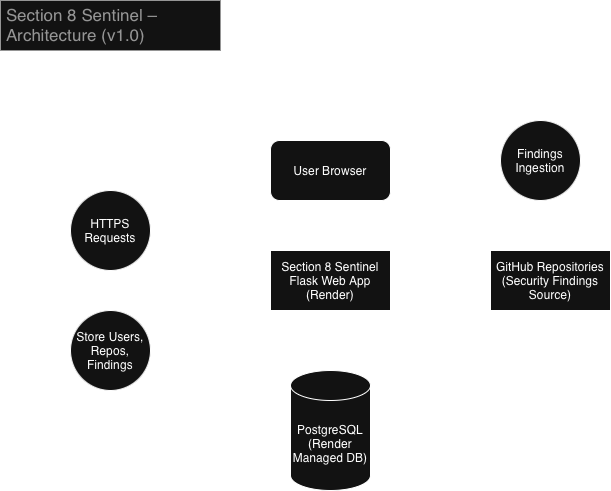

# Section 8 Sentinel

## Overview

Section 8 Sentinel is a lightweight DevSecOps-style security dashboard designed to track repositories and surface security findings in a simple, centralised interface.

The goal of this project was to build a working security tool from the ground up, deploy it to the cloud, connect it to a live database, and demonstrate the full lifecycle of a modern web application in a DevSecOps context.

This project was built as part of my transition into cybersecurity and DevSecOps after over 20 years working in electrical construction and site management.

---

## Live Demo

**Deployed application:**
https://section8-sentinel.onrender.com

> Note: Demo environment may be reset periodically.

---

## Core Features (v1.0.0)

* User registration and login
* Repository tracking per user
* Security findings ingestion (Trivy / Gitleaks style JSON)
* Severity classification
* Finding status workflow:

  * Open
  * Fixed
  * Ignored
* PostgreSQL-backed data storage
* Cloud deployment on Render
* Simple security dashboard UI
* CI security pipeline (Bandit + pip-audit)

---

## Screenshots

### Dashboard

*Add screenshot here later if desired*

---

## Tech Stack

### Backend

* Python
* Flask
* SQLAlchemy
* PostgreSQL

### Frontend

* HTML
* CSS
* Jinja templates

### Infrastructure

* Render (cloud hosting)
* Managed PostgreSQL database

### Security & CI

* GitHub Actions
* Bandit (SAST)
* pip-audit (dependency scanning)

---

## Architecture Diagram



The application handles authentication, stores repository data, ingests findings, and displays them through a simple dashboard interface.

---

## How It Works

1. User registers and logs into the application.
2. User adds a repository to track.
3. Security scan results are ingested into the system.
4. Findings are stored in PostgreSQL.
5. Dashboard displays the latest findings.
6. User can mark findings as:

   * Open
   * Fixed
   * Ignored

---

## CI Security Pipeline

This project includes a basic DevSecOps pipeline that runs on every push:

1. **Bandit** scans Python code for security issues.
2. **pip-audit** checks dependencies for known vulnerabilities.
3. Security reports are uploaded as GitHub Actions artifacts.

This demonstrates secure development practices and automated security checks.

---

## Local Setup

### 1. Clone the repository

```bash
git clone https://github.com/YOUR_USERNAME/section8-sentinel.git
cd section8-sentinel
```

### 2. Create virtual environment

```bash
python3 -m venv .venv
source .venv/bin/activate
```

### 3. Install dependencies

```bash
pip install -r requirements.txt
```

### 4. Set environment variables

Create a `.env` file or export variables:

```bash
export SECRET_KEY=dev
export DATABASE_URL=sqlite:///app.db
```

### 5. Run the app

```bash
python run.py
```

Open:

```
http://127.0.0.1:5000
```

---

## Project Goals

This project demonstrates:

* Full-stack web application development
* Database design and migrations
* Secure coding practices
* CI-based security scanning
* Cloud deployment and debugging
* Real-world DevSecOps workflows

---

## Release

**Current version:** v1.0.0
Initial public release with working dashboard, ingestion, and CI security pipeline.

---

## Author

Aaron Doran
DevSecOps / Cybersecurity transition project
Originally from electrical construction and site management background.


### 1) Clone
```bash
git clone git@github.com:ApacheSBC/section8-sentinel.git
cd section8-sentinel
